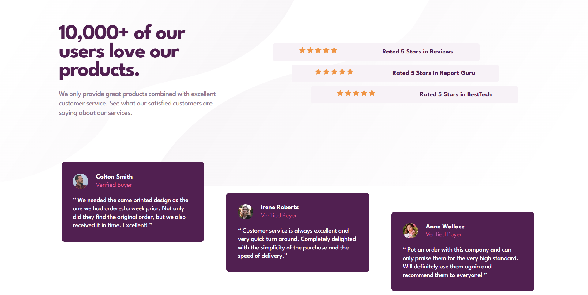
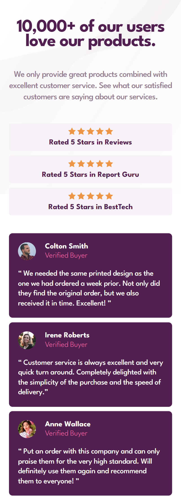

# social-proof-section

# Social Proof Section

This is a solution to the [Social Proof Section challenge on Frontend Mentor](https://www.frontendmentor.io/challenges/social-proof-section-6e0qTv_bA). Frontend Mentor challenges help you improve your coding skills by building realistic projects.

## Table of Contents

- [Overview](#overview)
  - [The Challenge](#the-challenge)
  - [Screenshot](#screenshot)
  - [Links](#links)
- [My Process](#my-process)
  - [Built With](#built-with)
  - [What I Learned](#what-i-learned)
  - [Continued Development](#continued-development)
  - [Useful Resources](#useful-resources)
- [Author](#author)

---

## Overview

### The Challenge

Users should be able to:

- View the optimal layout for the section depending on their device's screen size.
- See hover and focus states for interactive elements.

### Screenshot




### Links

- Live Site URL: [](https://aouintihouari.github.io/social-proof-section/)
- Solution URL: [](https://github.com/aouintihouari/social-proof-section)

---

## My Process

### Built With

- Semantic HTML5 markup
- CSS custom properties
- Flexbox
- Mobile-first workflow
- [Google Fonts](https://fonts.google.com/) for typography

### What I Learned

This project helped me improve my ability to create responsive designs with flexbox and media queries. Here's an example of a media query used:

```css
@media screen and (min-width: 768px) {
  .hero {
    display: flex;
    justify-content: space-between;
  }
}
```

### Continued Development

In the future, I aim to:

- Explore advanced CSS animations to enhance interactivity.
- Utilize CSS Grid for more complex layouts.
- Refactor the code for better scalability and readability.

### Useful Resources

- [MDN Web Docs](https://developer.mozilla.org/en-US/) - Great for understanding HTML and CSS properties.
- [CSS Tricks](https://css-tricks.com/) - A helpful resource for responsive design techniques.

---

## Author

- Frontend Mentor - [@houariaouinti](https://www.frontendmentor.io/profile/aouintihouari)
- X - [@Houari_Aouinti](https://x.com/Houari_Aouinti)

---

### Notes

To run this project locally:

1. Clone the repository.
2. Open the `index.html` file in your browser.
